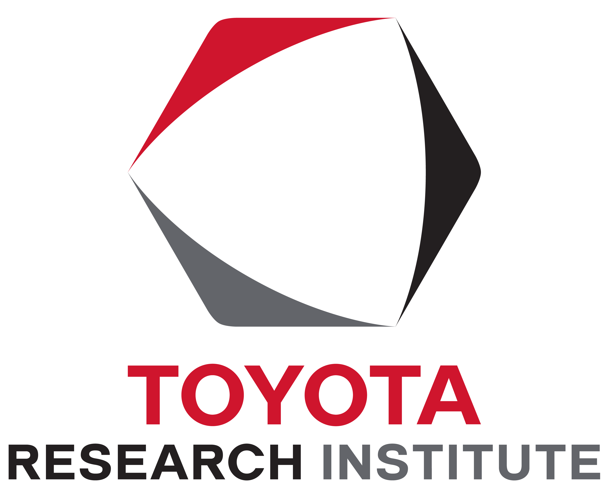
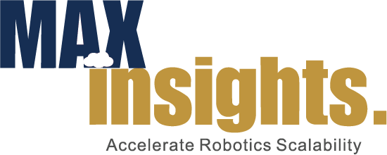
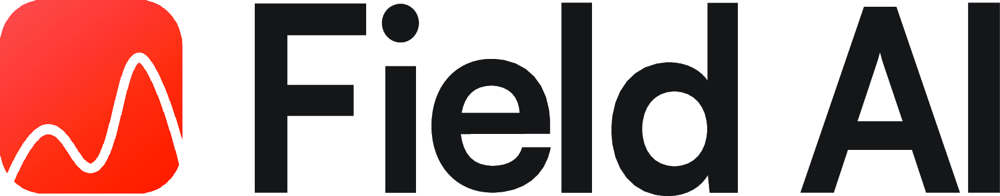
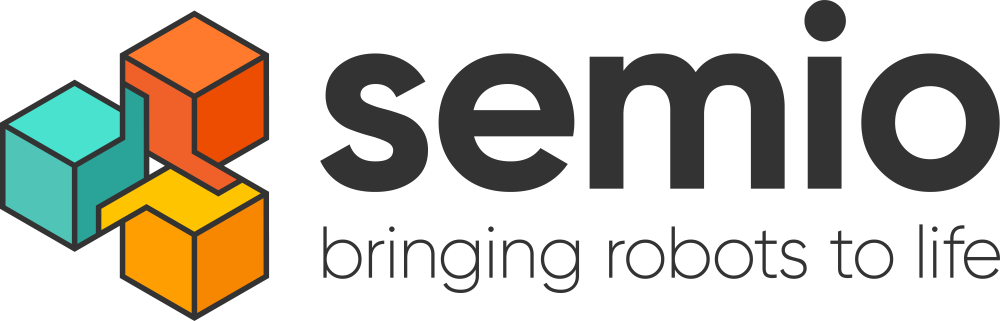
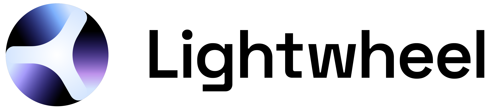
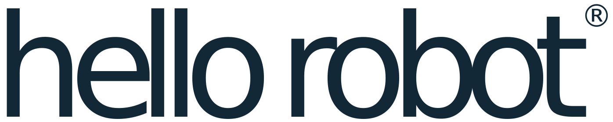
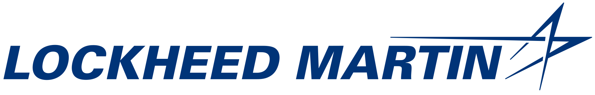
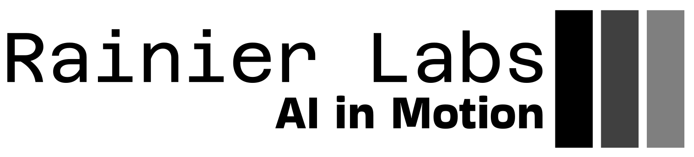

<!-- 

  The registration portal is now open! Click <a href="{{ site.baseurl }}/attending/registration/" style="color: #0000EE; text-decoration: underline;">here</a> for details.

 -->

<!-- 

  Getting ready for your RSS 2025 trip? Please find important <a href="{{ site.baseurl }}/attending/travel/" style="color: #0000EE; text-decoration: underline;">travel information here</a>.

 -->

<h1 class="page-title">{{ site.title }} 
June 21 &ndash; June 25, 2025 Los Angeles, California</h1>

<!-- recording -->

  

    <iframe
      id="rss-yt"
      title="RSS 2025 Recording"
      src="https://www.youtube.com/embed/QqK0IKINJEQ?rel=0&modestbranding=1"
      frameborder="0"
      allow="accelerometer; autoplay; clipboard-write; encrypted-media; gyroscope; picture-in-picture; web-share"
      allowfullscreen
    ></iframe>
  

  

    <button class="daybutton active" data-yt="QqK0IKINJEQ">Jun 22</button>
    <button class="daybutton" data-yt="qJgmmudGrY8">Jun 23</button>
    <button class="daybutton" data-yt="b6SVm8zuUcc">Jun 24</button>
    <button class="daybutton" data-yt="74EDmPwbOYc">Jun 25</button>
  

<!-- ### Important Announcements -->

  
We sincerely thank all participants—in-person and virtual—for joining us at <i>Robotics: Science and Systems 2025</i>. From inspiring keynotes and technical sessions to vibrant discussions and demos, we hope RSS 2025 was a valuable and memorable experience for everyone.

  
<strong>Need a Certificate of Attendance?</strong> Participants who require a certificate can access and download it via their PheedLoop mobile app. Once you open the app, please click on the top-left menu icon and then click “Certificate” to download the digital certificate of attendance.

<!-- 

  <strong>Weekend Vehicle Access:</strong> On weekends, the only open entrance to the USC campus is the <a href="https://maps.app.goo.gl/QPxY2eyPfaPqxFKQ8" style="color: #721c24; text-decoration: underline;">North Gate at 1064–1000 W Jefferson Blvd</a>. Pedestrian entrances remain open.

  <strong>Important Announcement:</strong>
  We want to reassure RSS attendees that the USC campus is unaffected by the recent protests in Los Angeles, and RSS 2025 will proceed as planned. The safety and well-being of our attendees remains our highest priority, and we will continue to monitor the situation and provide timely updates here. See the <a href="{{ site.baseurl }}/attending/travel/" style="color: #0000EE; text-decoration: underline;">Travel</a> page for additional information to help you plan your trip.

 -->

<!-- **Announcement 1:** In response to the recent wildfires in Los Angeles, we have made adjustments to the RSS 2025 submission timeline, to show our support to the LA community who is going to generously host us this June. While the abstract/title submission (January 17) and the initial paper submission (January 24) deadlines remain unchanged, the authors will be able to continue updating the pdf of their paper until January 31, 2025 (which is also the supplementary material deadline). For more details, read our [full announcement](/updates/la-wildfires/).
ocial Program
**Announcement 2:** Submitting an abstract (by the January 17 deadline) or a semi-complete paper (by the January 24 deadline) for a paper that is currently under submission to another conference (e.g. ICRA, ICLR, CVPR) is still considered a double submission and is forbidden by RSS rules. However, if the paper has substantial innovation with respect to the paper that is already in submission (i.e., it would qualify as a different and novel paper and you would not withdraw it even if the paper under review is accepted), you should feel free to submit it to RSS. -->

### News and Updates

- Registration portal is open [here]({{ site.baseurl }}/attending/registration/).
- Travel Information is available [here]({{ site.baseurl }}/attending/travel/).
- Explore the Social Program [here]({{ site.baseurl }}/attending/social/).

---

### Call for Participation

We are pleased to announce the 21st edition of the “Robotics: Science and Systems” (RSS) conference to be held at the [University of Southern California](https://www.usc.edu/){:target="_blank"}, Los Angeles, California from June 21-25, 2025. 
After being hosted at the University of Southern California in 2011, the organizers are excited to bring RSS back to this iconic venue in 2025.

RSS has a long history of bringing together researchers in all areas of robotics from around the world for an engaging and focused week of single-track presentations, workshops, poster sessions, and tutorials. This year, as always, we solicit your best work.

### Important Dates

<table class="table">
    <thead>
      <tr>
        <th colspan="3">Timeline</th>
      </tr>
    </thead>
    <tbody>
      <tr>
        <td><s>January 17, 2025</s></td>
        <td class="nowrap">11:59pm <a href="https://time.is/Anywhere_on_Earth">AoE</a></td>
        <td class="wrap">Abstract/Title Submission Deadline</td>
      </tr>
      <tr>
        <td><s>January 24, 2025</s></td>
        <td class="nowrap">11:59pm <a href="https://time.is/Anywhere_on_Earth">AoE</a></td>
        <td class="wrap">Initial Paper and Demo Submission Deadline (this requires a semi-complete pdf of the paper, final title and abstract)</td>
      </tr>
      <tr>
        <td><s>January 31, 2025</s></td>
        <td class="nowrap">11:59pm <a href="https://time.is/Anywhere_on_Earth">AoE</a></td>
        <td class="wrap">Final PDF Submission Deadline</td>
      </tr>
      <tr>
        <td><s>January 31, 2025</s></td>
        <td class="nowrap">11:59pm <a href="https://time.is/Anywhere_on_Earth">AoE</a></td>
        <td class="wrap">Supplementary Material Submission Deadline</td>
      </tr>
      <tr>
        <td><s>February 11, 2025</s></td>
        <td class="nowrap">11:59pm <a href="https://time.is/Anywhere_on_Earth">AoE</a></td>
        <td class="wrap"><a href="https://sites.google.com/view/rsspioneers2025/" target="_blank">RSS Pioneers</a> Application Deadline</td>
      </tr>
      <tr>
        <td><s>February 16, 2025</s></td>
        <td class="nowrap">11:59pm <a href="https://time.is/Anywhere_on_Earth">AoE</a></td>
        <td class="wrap">Workshop Proposal Deadline</td>
      </tr>
      <tr>
        <td><s>March 17, 2025</s></td>
        <td class="nowrap">11:59pm <a href="https://time.is/Anywhere_on_Earth">AoE</a></td>
        <td class="wrap">Reviews Released and Rebuttal Invitations</td>
      </tr>
      <tr>
        <td><s>March 22, 2025</s></td>
        <td class="nowrap">11:59pm <a href="https://time.is/Anywhere_on_Earth">AoE</a></td>
        <td class="wrap">Workshop Decisions Announcement</td>
      </tr>
      <tr>
        <td><s>March 24, 2025</s></td>
        <td class="nowrap">11:59pm <a href="https://time.is/Anywhere_on_Earth">AoE</a></td>
        <td class="wrap">Rebuttal Submission Deadline</td>
      </tr>
      <tr>
        <td><s>April 10, 2025</s></td>
        <td class="nowrap">11:59pm <a href="https://time.is/Anywhere_on_Earth">AoE</a></td>
        <td class="wrap">Paper and Demo Acceptance Notification</td>
      </tr>
      <tr>
        <td><s>April 20, 2025</s></td>
        <td class="nowrap">11:59pm <a href="https://time.is/Anywhere_on_Earth">AoE</a></td>
        <td class="wrap"><a href="https://sites.google.com/view/rsspioneers2025/" target="_blank">RSS Pioneers</a> Notification of Acceptance</td>
      </tr>
      <tr>
        <td><s>April 25, 2025</s></td>
        <td class="nowrap">11:59pm <a href="https://time.is/Anywhere_on_Earth">AoE</a></td>
        <td class="wrap">Final Camera Ready Paper Submission</td>
      </tr>
      <tr>
        <td>June 20, 2025</td>
        <td>—</td>
        <td class="wrap"><a href="https://sites.google.com/view/rsspioneers2025/" target="_blank">RSS Pioneers</a> Workshop</td>
      </tr>
      <tr>
        <td>June 21 &ndash; June 25, 2025</td>
        <td>—</td>
        <td class="wrap">RSS 2025, Los Angeles, California</td>
      </tr>
    </tbody>
</table>

  
  

 

---

<h3 id="sponsors">Sponsors</h3>

<!-- Row 1 -->

  

<!-- Row 2 -->

  

<!-- Row 3 -->

  
  

<!-- Row 4 -->

  
  
  

<!-- Row 5 -->

  
  
  

<!-- Row 6 -->

  
  
  

<!-- Row 7 -->

  
  
  

<!-- Row 7.5 -->

  

<!-- Row 8 -->

  
  

---
The website of the RSS 2024 conference can be found [here]({{ site.url }}/2024/).

 
 
 
 
 
